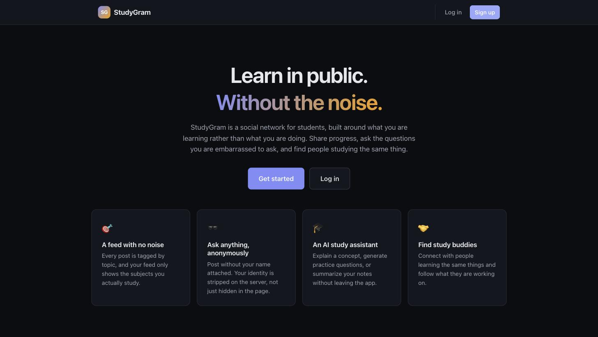
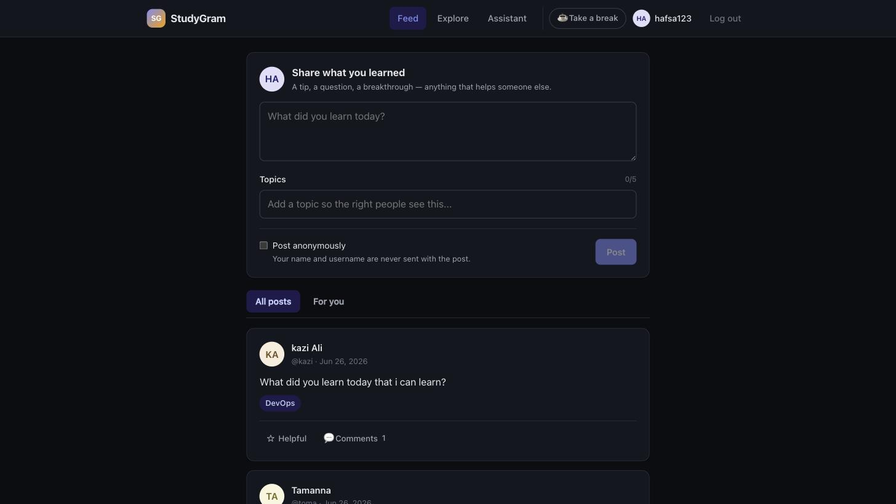
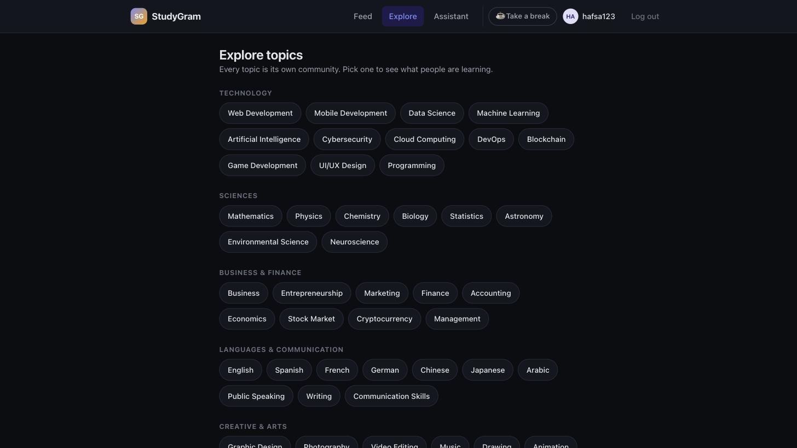
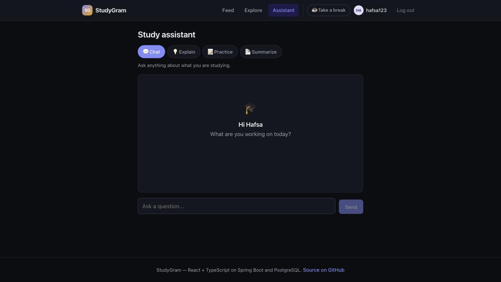
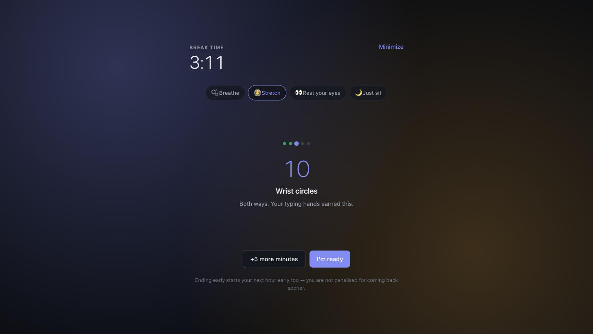

# StudyGram

A social network for students, built around **what you're learning** rather than what you're doing.

Every post is tagged by topic so your feed only shows subjects you actually study, questions can be
asked anonymously, and an AI study assistant is built in — along with a *Take a break* timer that
makes you stop every so often.

**Stack:** React 19 + TypeScript (Vite) · Spring Boot 3 + Java · PostgreSQL · Groq API



---

## Contents

- [What it does](#what-it-does)
- [Screenshots](#screenshots)
- [Architecture](#architecture)
- [Data model](#data-model)
- [Running it locally](#running-it-locally)
- [API reference](#api-reference)
- [Engineering notes](#engineering-notes)
- [Known limitations](#known-limitations)

---

## What it does

| Feature | Description |
| --- | --- |
| **Topic-based feed** | Posts carry one to five topics. The *For you* feed returns only posts matching the interests on your profile. |
| **Anonymous posting** | Publish without your identity attached. The server strips the author entirely — see [Engineering notes](#anonymity-is-enforced-on-the-server). |
| **Helpful marks & comments** | A join table records who found what helpful, so a post can be marked once per person and show who did. |
| **Communities** | All 64 topics are browsable communities, seeded on startup. |
| **AI study assistant** | Four modes — chat, explain a topic, generate practice questions, summarize notes — via the Groq API. |
| **Take a break** | A 5-minute timer with finite calming activities, then a one-hour cooldown enforced server-side. |
| **Privacy controls** | Seven per-field switches. A hidden field is omitted from the API response, not merely hidden in the UI. |
| **GitHub showcase** | Optionally pulls your public repositories onto your profile. |
| **Study buddies** | Send, accept and reject buddy requests. *(API complete; no UI yet.)* |

## Screenshots

| The feed | Explore topics |
| --- | --- |
|  |  |

| AI study assistant | Take a break |
| --- | --- |
|  |  |

The interface follows your system light/dark preference.

---

## Architecture

Two independently runnable applications talking over HTTP:

```
┌──────────────────────────┐         ┌──────────────────────────┐        ┌────────────┐
│  React + TypeScript      │  JSON   │  Spring Boot             │  JPA   │            │
│  Vite dev server :5173   │ ──────▶ │  REST API :8080          │ ─────▶ │ PostgreSQL │
│                          │ ◀────── │                          │ ◀───── │            │
└──────────────────────────┘         └───────────┬──────────────┘        └────────────┘
                                                 │
                                    ┌────────────┴────────────┐
                                    ▼                         ▼
                              Groq API                  GitHub REST API
                           (study assistant)          (profile showcase)
```

They run on different ports, which browsers treat as different origins, so
`config/CorsConfig.java` declares which origins may call the API.

### Backend layering

The backend follows the standard Spring layering, one responsibility per layer:

```
HTTP request
    │
    ▼
Controller ──── maps URLs to methods, converts JSON, returns status codes
    │
    ▼
Service ─────── business rules: ownership checks, validation, password hashing
    │
    ▼
Repository ──── database access (Spring Data generates the SQL)
    │
    ▼
Entity ──────── a class that maps to a table
```

**DTOs** sit alongside this. Nothing that leaves the API is an entity — every response is a
purpose-built class in `dto/`, which is what makes anonymity and the privacy switches enforceable
rather than cosmetic.

### Frontend structure

```
src/
├── api.ts                  every backend call, typed, one base URL
├── types.ts                interfaces mirroring the backend DTOs
├── App.tsx                 routing and auth state, nothing else
├── hooks/
│   ├── useAuth.ts          session, persisted to localStorage
│   ├── useBreak.ts         break state and countdown
│   └── useTopics.ts        the topic list, fetched once and cached
├── components/             one file per screen or reusable piece
└── utils/format.ts         timestamps, initials, avatar colours
```

---

## Data model

```
users ─────┬──< posts >──── post_topics
           │      │
           │      ├──< comments
           │      └──< helpfuls
           │
           ├──< study_buddies >── users     (self-referencing: user_id + buddy_id)
           ├──< break_sessions
           └──< password_reset_tokens

communities                                (standalone; matched to posts by topic name)
```

Three tables are worth calling out:

- **`post_topics`** — a post's topics get one row each rather than a comma-separated string in one
  column. This is what makes the personalized feed a plain indexed lookup instead of substring
  matching. See [Engineering notes](#normalizing-topics-fixed-the-personalized-feed).
- **`helpfuls`** — a join table of `(user, post)`. Being a row rather than a counter is what stops
  double-marking and lets the app list who found a post useful.
- **`password_reset_tokens`** — random, expiring, single-use.

---

## Running it locally

### Prerequisites

- Java 17+
- Node 18+
- PostgreSQL running locally
- A free [Groq API key](https://console.groq.com/keys) *(optional — everything except the AI
  assistant works without one)*

### 1. Create the database

```bash
createdb studygram
```

Tables are created automatically on first run (`spring.jpa.hibernate.ddl-auto=update`), and the 64
communities are seeded by `CommunitySeeder`.

### 2. Configure the backend

```bash
cd studygram-backend
cp .env.example .env
```

Edit `.env` with your PostgreSQL role and, if you have one, your Groq key:

```bash
DB_URL=jdbc:postgresql://localhost:5432/studygram
DB_USERNAME=postgres     # on macOS + Homebrew this is usually your Mac username
DB_PASSWORD=
GROQ_API_KEY=            # optional
```

`.env` is gitignored. No credential is ever committed — `application.properties` reads everything
from the environment.

### 3. Start the backend

```bash
./run.sh          # loads .env, then starts Spring Boot on :8080
```

### 4. Start the frontend

```bash
cd studygram-frontend
npm install
npm run dev       # http://localhost:5173
```

### Resetting a password in development

There is no mail server, so the reset token is written to the **backend console** instead of being
emailed — the same pattern Django and Rails use in development. Request a reset in the UI, copy the
token from the terminal running the backend, and paste it into step 2.

---

## API reference

All endpoints are prefixed `/api`. `viewerId` is optional throughout and tells the server who is
asking, so it can decide what that person may see.

### Auth

| Method | Endpoint | Purpose |
| --- | --- | --- |
| `POST` | `/signup` | Create an account |
| `POST` | `/login` | Log in |
| `POST` | `/forgot-password` | Request a reset token |
| `POST` | `/reset-password` | Redeem a token and set a new password |
| `POST` | `/change-password` | Change password while logged in |

### Profile

| Method | Endpoint | Purpose |
| --- | --- | --- |
| `GET` | `/profile/{username}?viewerId=` | Fetch a profile, privacy rules applied |
| `PUT` | `/profile/{userId}` | Update profile and privacy switches |

### Posts

| Method | Endpoint | Purpose |
| --- | --- | --- |
| `GET` | `/posts?viewerId=` | Main feed, newest first |
| `GET` | `/posts/feed/{userId}` | Personalized feed by interests |
| `GET` | `/posts/user/{userId}?viewerId=` | One user's posts |
| `POST` | `/posts` | Create a post |
| `POST` | `/posts/{id}/helpful?userId=` | Toggle a helpful mark |
| `DELETE` | `/posts/{id}?userId=` | Delete your own post |

### Comments, communities, breaks, AI, GitHub

| Method | Endpoint | Purpose |
| --- | --- | --- |
| `GET` | `/comments/post/{postId}?viewerId=` | Comments on a post |
| `POST` | `/comments` | Add a comment |
| `DELETE` | `/comments/{id}?userId=` | Delete a comment |
| `GET` | `/communities` | All topics, with categories |
| `GET` | `/communities/{name}/posts` | Posts in one community |
| `GET` | `/breaks/status/{userId}` | Break state: available, active or cooling down |
| `POST` | `/breaks/start\|extend\|end?userId=` | Control a break |
| `POST` | `/ai/chat\|explain\|practice\|summarize` | Study assistant |
| `GET` | `/github/{username}/profile\|repos` | Public GitHub data |

---

## Engineering notes

Problems worth explaining, because the fix is more interesting than the feature.

### Anonymity is enforced on the server

The first version of `PostResponse` sent `authorName: "Anonymous"` but still included the real
`authorId`, because the React app needed it to decide whether to draw a Delete button.

That defeated the feature entirely. Anyone could open DevTools, read the raw JSON, and match the ID
back to a user. The post *said* anonymous; the data underneath did not.

Now an anonymous post carries **no identifying field at all** — `authorId` and `authorUsername` are
null. Ownership is signalled instead by a boolean `ownPost`, computed server-side for the one person
asking, which answers "may I delete this?" without naming anybody.

> If the browser must not know something, do not send it. Hidden in the UI is not hidden.

The same rule drives `UserProfileResponse`: a field you have marked private is never written into
the response, so there is nothing to find in the page source.

### Normalizing topics fixed the personalized feed

Topics were stored as one string — `"Programming, Web Development"` — in a single column. The
personalized feed then tried to match a user's interest against that whole string, and
`"Programming"` never equals `"Programming, Web Development"`. **The *For you* tab returned zero
posts, always.** Splitting on `","` also left a leading space on every item after the first, which
broke the comparison a second time.

The fix was to normalize: each topic became its own row in `post_topics`. Matching is now an
ordinary indexed lookup, a post can carry any number of topics, and the feed works.

### Deleting a post used to crash

`comments.post_id` and `helpfuls.post_id` are foreign keys, and a database will not delete a row that
other rows still reference. Any post someone had commented on could not be deleted — it failed with
a constraint violation.

`PostService.deletePost` now removes the children first, inside a single `@Transactional` method so a
partial failure rolls the whole thing back.

### Password reset needed a token

The original flow accepted an email address *and* a new password in one request, which meant anyone
who knew your email could take your account.

It is now two steps. Step one creates a random, 30-minute, single-use token tied to the account. Step
two exchanges the token for a new password — and takes **no** email or user ID, so the caller cannot
name whose password to change.

Step one also returns an identical response whether or not the account exists, so the endpoint cannot
be used to discover which email addresses are registered (*user enumeration*). Login does the same,
answering "incorrect email or password" without saying which.

### Removing N+1 queries from the feed

Building the feed used to call `getCommentCount(postId)` and `getHelpfulUsers(postId)` once per post,
and each of those re-fetched the post first. Fifty posts meant over two hundred round trips to the
database to render one page.

`PostService.toResponses` now fetches the counts for the whole batch in two `GROUP BY` queries and
stitches them together in memory. The feed costs a fixed number of queries regardless of how many
posts come back.

### The break timer is anchored to a server timestamp

Counting down in JavaScript is unreliable: browsers throttle timers in background tabs, the clock
stops while a laptop sleeps, and anything in memory can be edited from the console.

The server sends an absolute `endsAt` and the client recomputes `endsAt - now` on every tick. Ticks
can be late, throttled or skipped and the displayed time is still right — the tick only decides *when
to re-read the clock*, never what the answer is.

The cooldown deliberately starts when a break **ends**, not when it starts, so the study period
between breaks is always a full hour whether the break ran five minutes or ten.

---

## Known limitations

Honest list of what is not finished. These are known, not overlooked.

- **No real authentication.** Endpoints take a `userId` parameter and trust it. Ownership is checked
  (`you can only delete your own posts`), but nothing proves you are who you claim. Replacing this
  with JWTs issued at login and verified per request is the single most important next task, and it
  is why Spring Security's auto-configuration is currently switched off.
- **No pagination.** The feed returns every post. Fine at demo scale, wrong at any real size.
- **Study buddies has no UI.** The API is complete and tested; nothing in React calls it yet.
- **No automated tests** beyond the Spring context-load check. The flows in
  [Engineering notes](#engineering-notes) were verified manually against a running server.
- **`ddl-auto=update` instead of migrations.** Convenient in development; a real deployment needs
  Flyway or Liquibase so schema changes are versioned and reversible.
- **Navigation is component state, not routes.** There is no react-router, so pages are not linkable
  and the browser Back button does not move between them.
- **Break "today" uses the server's timezone**, which is wrong for anyone in a different one.

---

## What I learned building this

- Where a rule is enforced matters more than whether it exists. Three separate bugs here — the
  anonymous author ID, the privacy switches, the break cooldown — were all the same mistake: a rule
  implemented in the browser, where the user controls the code.
- Denormalized data reads fine and queries terribly. One comma-separated column silently broke a
  headline feature for months.
- Foreign keys will not let you delete a parent while children point at it, and the error surfaces
  at the worst possible moment — in front of somebody.
